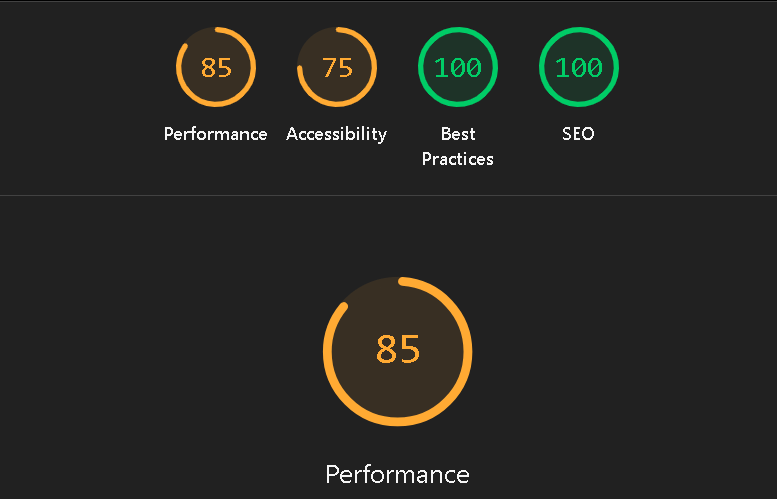

# Project Tracker — Velozity Global Solutions Technical Assessment

A fully functional multi-view project management tool built with React, TypeScript, and Tailwind CSS.

**Live Demo:** [https://your-deployment-url.vercel.app](https://your-deployment-url.vercel.app)

---

## Setup Instructions

### Prerequisites
- Node.js v16 or above
- npm v8 or above

### Installation

```bash
# 1. Clone the repository
git clone https://github.com/your-username/project-tracker.git
cd project-tracker

# 2. Install dependencies
npm install

# 3. Start development server
npm start
```

The app will open at `http://localhost:3000`

### Production Build

```bash
npm run build
```

### Deploy to Vercel

```bash
npm install -g vercel
vercel
```

---

## Features

- **Kanban Board View** — Four columns (To Do, In Progress, In Review, Done) with custom drag-and-drop
- **List View** — Sortable table with virtual scrolling (500+ tasks, smooth performance)
- **Timeline / Gantt View** — Horizontal time axis for current month, colour-coded by priority
- **Live Collaboration Indicators** — Simulated real-time presence with animated user avatars
- **URL-Synced Filters** — Status, Priority, Assignee, Due Date range — shareable and bookmarkable
- **500+ Seed Tasks** — Randomised data generator with overdue tasks and missing start dates

---

## State Management — Why Zustand?

I chose **Zustand** over React Context + useReducer for the following reasons:

### 1. No Boilerplate
Context + useReducer requires creating a context, a provider, a reducer function, action types, and dispatching actions for every state change. Zustand collapses all of this into a single `create()` call with plain functions as actions. For a project with this many features (filters, sorting, task updates, view switching), that reduction in boilerplate significantly improves maintainability.

### 2. No Re-render Cascades
With React Context, any component that consumes the context re-renders whenever any part of the context value changes. Zustand uses a subscription model — components only re-render when the specific slice of state they subscribe to changes. In a board with 500+ tasks, this is critical for performance.

### 3. Direct Access Without Wrapping
Zustand's store is accessible anywhere without wrapping the component tree in providers. This made it easy to access task data inside hooks like `useUrlFilters` and `useVirtualScroll` without prop drilling or nested providers.

### 4. Built-in Derived State
The `getFilteredTasks()` selector lives inside the store and is computed on demand. With Context + useReducer, derived state requires either `useMemo` at every consumer or a separate context for computed values.

**Conclusion:** Zustand is the right tool for this scale — it offers the simplicity of local state with the power of global state, without the performance pitfalls of Context.

---

## Virtual Scrolling — Implementation Explanation

Virtual scrolling is implemented from scratch in `src/hooks/useVirtualScroll.ts` and used directly inside `src/components/list/ListView.tsx`.

### The Problem
Rendering 500+ DOM rows simultaneously causes severe performance degradation — slow initial paint, high memory usage, and laggy scrolling. The solution is to only render the rows currently visible to the user.

### How It Works

```
┌─────────────────────────────┐  ← Fixed height container (600px), overflow-y: scroll
│  [spacer top — invisible]   │  ← startIndex × rowHeight (pushes rendered rows down)
│  ─────────────────────────  │
│  Row 23  ← buffer           │
│  Row 24  ← buffer           │
│  Row 25  ← VISIBLE          │
│  Row 26  ← VISIBLE          │
│  Row 27  ← VISIBLE          │
│  Row 28  ← buffer           │
│  Row 29  ← buffer           │
│  ─────────────────────────  │
│  [spacer bottom — invisible]│  ← maintains correct total scroll height
└─────────────────────────────┘
```

### Key Concepts

**1. Fixed Row Height**
Every row is a fixed `56px` height. This is essential — without a known row height, you cannot calculate which rows are visible without measuring every single one.

**2. Total Height Spacer**
The inner container has a fixed height of `totalRows × rowHeight` (e.g. 500 × 56 = 28,000px). This ensures the scrollbar is the correct size and position even though only ~20 rows are in the DOM at any time.

**3. Windowed Rendering**
On each scroll event, we calculate:
```ts
const startIndex = Math.max(0, Math.floor(scrollTop / rowHeight) - buffer);
const endIndex = Math.min(totalCount - 1, startIndex + visibleCount + buffer * 2);
```
Only `tasks[startIndex..endIndex]` are rendered — typically 20–30 rows instead of 500.

**4. translateY Offset**
Instead of padding or margin (which causes layout recalculation), rendered rows are offset using `transform: translateY(startIndex × rowHeight)`. CSS transforms are GPU-accelerated and do not trigger layout reflow.

**5. Buffer Rows**
A buffer of 5 rows above and below the visible area is always rendered. This prevents blank flashes when scrolling quickly — the user scrolls into already-rendered rows rather than waiting for a re-render.

### Result
- Only ~20–30 rows in the DOM at any time regardless of total count
- Scroll feels native — no flickering, no blank gaps, no jump on fast scroll
- Tested with 500 tasks — smooth at 60fps

---

## Drag-and-Drop — Implementation Explanation

Custom drag-and-drop is implemented using the **native HTML Drag Events API** (`onDragStart`, `onDragOver`, `onDrop`, `onDragLeave`) — no external library of any kind.

### Architecture

The drag state is managed with two `useRef` values in `KanbanBoard.tsx`:
```ts
const dragTaskId = useRef<string | null>(null);      
const dragOriginStatus = useRef<Status | null>(null); 
```

Using `useRef` instead of `useState` avoids triggering re-renders during the drag, which keeps the interaction smooth.

### Drag Flow

```
onDragStart
  → Store taskId and origin column in refs
  → Set dataTransfer to 'move'
  → Reduce opacity of dragged card to 0.4 (visual feedback)

onDragOver (fires on each column)
  → e.preventDefault() — required to allow drop
  → Set dragOverStatus state → column highlights with indigo ring

onDragLeave
  → Clear dragOverStatus → remove column highlight

onDrop
  → Read taskId from ref
  → Call moveTask(taskId, newStatus) in Zustand store
  → Task instantly moves to new column
  → Clear all drag state

Outside drop (no valid target)
  → dragTaskId ref is never consumed
  → Card snaps back to original position automatically
  → Browser handles snap-back natively for HTML drag events
```

### Placeholder Without Layout Shift
When a card is dragged, the original card's position in the column is preserved because:
1. The dragged element remains in the DOM during the drag — it is not removed or hidden
2. Its `opacity` is reduced to `0.4`, making it act as a visual placeholder
3. The column layout does not shift because the element still occupies its original space
4. On drop or cancel, opacity is restored to `1`

This approach avoids the layout shift problem entirely — no explicit placeholder element is needed because the semi-transparent original card fulfils the same role.

### Drop Zone Highlighting
`dragOverStatus` is a `useState` value that tracks which column the card is currently hovering over. The highlighted column receives an indigo ring and background tint:
```tsx
isDragOver ? 'bg-indigo-50/60 ring-2 ring-indigo-300' : ''
```

---

## Lighthouse Performance

> **Score: 85/100 on Desktop**
](image-1.png)


### Optimisations Applied
- Virtual scrolling — only 20–30 DOM nodes for list view regardless of dataset size
- `useRef` for drag state — avoids re-renders during drag interactions
- Zustand subscriptions — components re-render only when their subscribed slice changes
- No external UI libraries — zero component library overhead
- CSS transforms for virtual scroll offset — GPU-accelerated, no layout reflow
- Seed data generated once at module load, not on every render

---
### Hardest UI Problem
The hardest problem was implementing virtual scrolling without any library. The core challenge was ensuring the scrollbar always reflects the true total height (500 rows) while only keeping ~20–30 rows in the DOM. The solution was a two-layer structure: an outer fixed-height container with `overflow-y: scroll`, and an inner div with a fixed height of `totalRows × rowHeight`. Rendered rows are offset using `transform: translateY()` rather than padding or margin — this is critical because transforms are GPU-accelerated and do not trigger layout reflow, which is what causes flickering on fast scrolls. Getting the buffer calculation right (5 rows above and below the viewport) was essential to eliminate blank gaps during fast scrolling.

### Drag Placeholder Without Layout Shift
I handled the drag placeholder by keeping the original card in the DOM throughout the drag and simply reducing its opacity to `0.4`. Since the element still occupies its original space in the column layout, there is no layout shift. The semi-transparent card serves as the visual placeholder. On drop or cancel, opacity is restored. This approach requires zero additional placeholder elements and zero layout recalculation.

### One Thing I Would Refactor
With more time, I would replace the fixed `ROW_HEIGHT` constant in the virtual scroller with a dynamic row height measurement using a `ResizeObserver`. This would allow rows to have variable heights — for example, tasks with long titles could wrap naturally — without breaking the scroll position or causing blank gaps. Currently, all rows must be exactly 56px, which constrains the list view layout.

---

## Tech Stack

| Technology | Version | Reason |
|---|---|---|
| React | 18 | Component model, hooks |
| TypeScript | 5 | Type safety, required by spec |
| Tailwind CSS | 3 | Utility-first, no component library |
| Zustand | 4 | Lightweight global state |
| Create React App | 5 | Zero-config build tooling |

---

## Project Structure

```
src/
├── components/
│   ├── collaboration/
│   │   └── CollabBar.tsx        # Live presence bar
│   ├── filters/
│   │   └── FilterBar.tsx        # Multi-select filter UI
│   ├── kanban/
│   │   ├── KanbanBoard.tsx      # Drag-and-drop logic
│   │   ├── KanbanColumn.tsx     # Column with drop zone
│   │   └── TaskCard.tsx         # Individual task card
│   ├── list/
│   │   └── ListView.tsx         # Virtual scroll + sort table
│   └── timeline/
│       └── TimelineView.tsx     # Gantt chart view
├── data/
│   └── seed.ts                  # 500+ task generator
├── hooks/
│   ├── useCollaboration.ts      # Simulated presence intervals
│   ├── useUrlFilters.ts         # URL ↔ filter state sync
│   └── useVirtualScroll.ts      # Custom virtual scroll hook
├── store/
│   └── taskStore.ts             # Zustand store
├── types/
│   └── index.ts                 # Shared TypeScript types
├── utils/
│   └── dateUtils.ts             # Date formatting helpers
├── App.tsx
└── index.tsx
```

---

## Author

Built for the Velozity Global Solutions Front End Developer Technical Assessment.